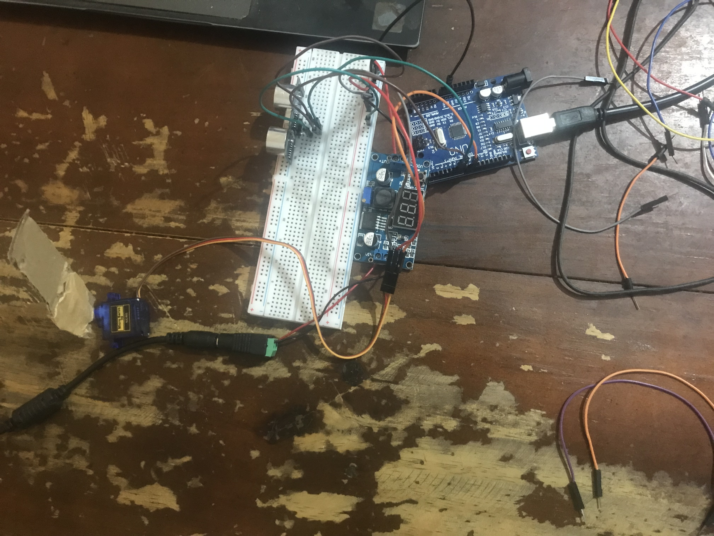

# Projeto 03 – Portão Automático com Máquina de Estados
# Project 03 – Automatic Gate Using Finite State Machine

---

## 🇧🇷 Português

### 🧠 Descrição
Projeto de um sistema de portão automático utilizando Máquina de Estados
Finitos (FSM), com o objetivo de simular a lógica de controle de um sistema
eletromecânico real.

O foco do projeto é a arquitetura de controle, independentemente do atuador
final, permitindo futura integração com motores, servos ou pontes H.

---

### ⚙️ Estados do Sistema
- **FECHADO**
- **ABRINDO**
- **ABERTO**
- **FECHANDO**

Cada estado possui comportamento bem definido, facilitando manutenção,
expansão e integração com sistemas mais complexos.

---

### 🔁 Lógica de Funcionamento
- Uma entrada analógica define as transições entre estados
- A lógica de decisão é separada da atuação
- O atuador é representado por um LED, simulando o motor do portão
- Estrutura preparada para evolução sem alteração da arquitetura base

---

### 🔌 Montagem do Circuito
Protótipo desenvolvido em protoboard para validação da lógica de controle por
FSM em um sistema físico real.

---

### 🛠️ Tecnologias Utilizadas
- Arduino
- C/C++
- Protoboard
- Componentes eletrônicos básicos (LED, resistores, potenciômetro)

---

### 📈 Possíveis Evoluções
- Integração com servo motor ou motor DC
- Sensores de fim de curso
- Controle de velocidade por PWM
- Integração futura com controle PID

---

### 📌 Status
✅ Concluído

---

## 🇺🇸 English

### 🧠 Description
Automatic gate system project using a Finite State Machine (FSM), designed to
simulate the control logic of a real electromechanical system.

The project focuses on control architecture rather than the final actuator,
allowing future integration with motors, servos, or H-bridges without changing
the core logic.

---

### ⚙️ System States
- **CLOSED**
- **OPENING**
- **OPEN**
- **CLOSING**

Each state has well-defined behavior, improving maintainability, scalability,
and system robustness.

---

### 🔁 Control Logic
- An analog input defines state transitions
- Decision logic is separated from actuation
- The actuator is represented by an LED simulating the gate motor
- Architecture prepared for future system expansion

---

### 🔌 Circuit Assembly
Breadboard prototype used to validate FSM-based control logic in a real
physical system.

## 📸 Circuito do Projeto

---

### 🛠️ Technologies Used
- Arduino
- C/C++
- Breadboard
- Basic electronic components (LED, resistors, potentiometer)

---

### 📈 Future Improvements
- Servo motor or DC motor integration
- Limit switch sensors
- PWM speed control
- Future PID control integration

---

### 📌 Status
✅ Completed
